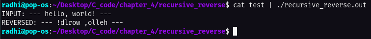

# Create a string reversing function that does it recursively _ implementation

This task is taken from **page 79**, the problem as stated in the book:

Write a recursive version of the function reverse(s), which reverses the string s in place.

---

# Code execution:

