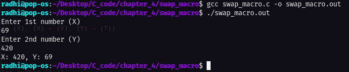

# Create a swap macro _ implementation

This task is taken from **page 81**, the problem as stated in the book:

Define a macro swap(t,x,y) that interchanges two arguments of type t. (Block structure will help.)

---

# Code execution:

