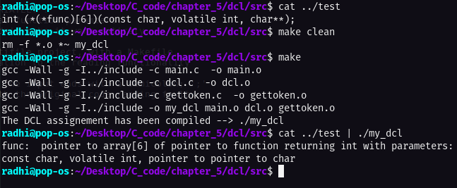

# Declaration to text conversion code _ implementation

This task is taken from **page 113**, the problem as stated in the book:

Expand dcl to handle declarations with function argument types, qualifiers like const, and so on.

---

# Code execution:

> Code execution of the declaration to text task

