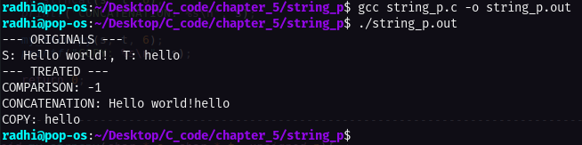

# Own versions of string manipulation functions _ implementation

This task is taken from **page 96**, the problem as stated in the book:

Write versions of the library functions strncpy, strncat, and strncmp, which operate on at most the first n characters of their argument strings. For example, strncpy(s,t,n) copies at most n characters of t to s. Full descriptions are in Appendix B.

---

# Code execution:

