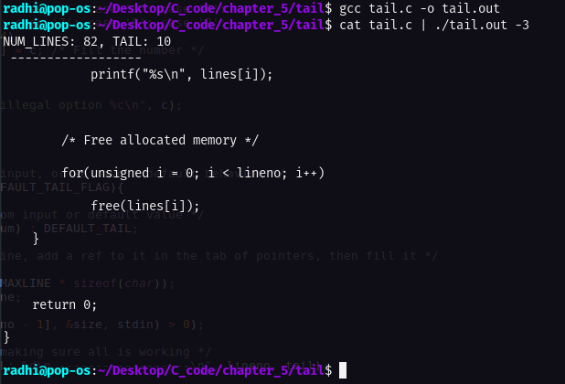

# Own version of tail function (unix) _ implementation

This task is taken from **page 106**, the problem as stated in the book:

Write the program tail, which prints the last n lines of its input. By default, n is set to 10, let us say, but it can be changed by an optional argument so that tail -n, prints the last n lines. The program should behave rationally no matter how unreasonable the input or the value of n. Write the program so it makes the best use of available storage; lines should be stored as in the sorting program of Section 5.6, not in a two-dimensional array of fixed size.

---

# Code execution:

