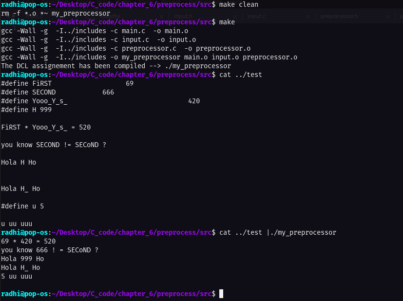

# Preprocessor of the "define" macro for C code _ implementation

This task is taken from **page 129**, the problem as stated in the book:

Implement a simple version of the #define processor (i.e., no arguments) suitable for use with C programs, based on the routines of this section. You may also find getch and ungetch helpful.

---

# Code execution:

> Code execution of the simple preprocessor task

